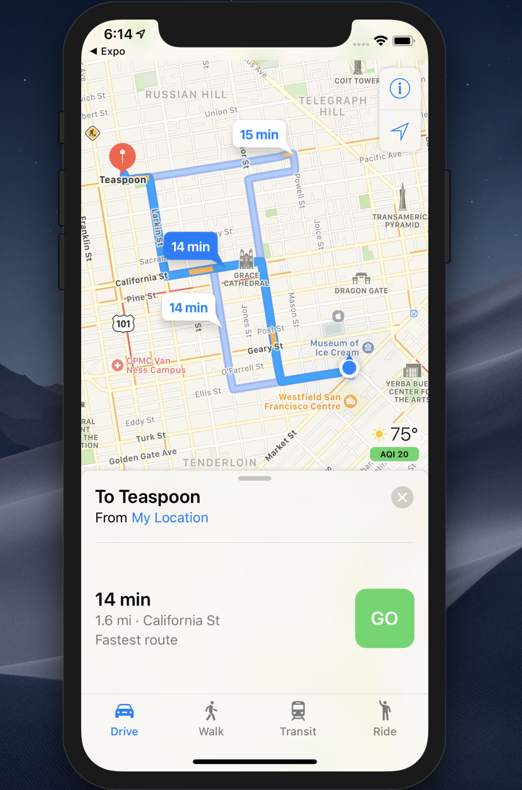
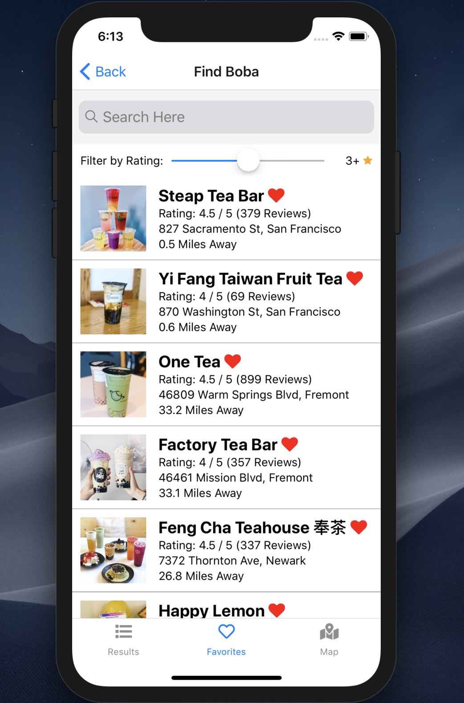
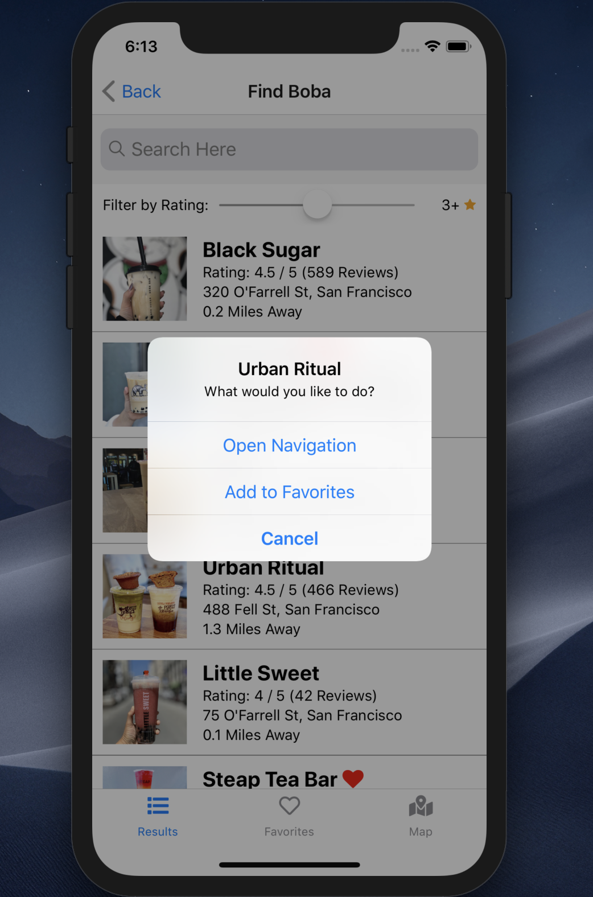

# BobaBuddy

BobaBuddy is a mobile application that allow users to discover nearby boba shops with a tap of a button. Results are rendered in a list view as well as a map view. Users can manage favorites as well as navigate to selected boba shops.

Check it out at: https://expo.io/@willchan8/boba-buddy

Technologies used: React-Native, React-Navigation, Yelp API, GraphQL, Expo, Express, Node.js, MongoDB Atlas, Mongoose, and Heroku

## Running the app

- Run `yarn` or `npm install`
- Run [`expo start`](https://docs.expo.io/versions/latest/workflow/expo-cli/), try it out.